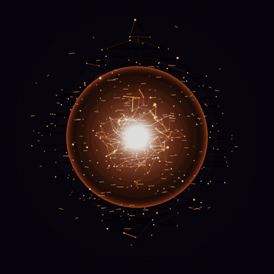
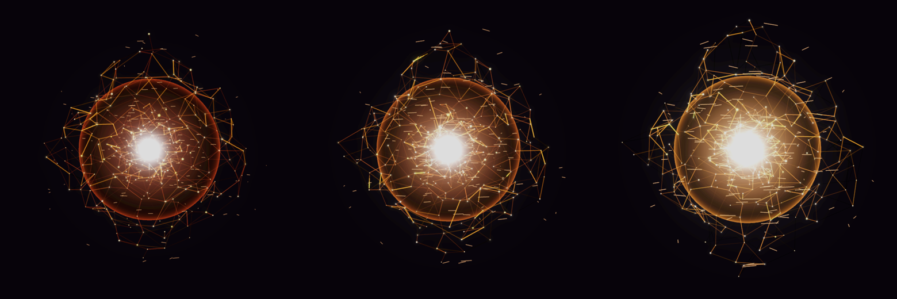
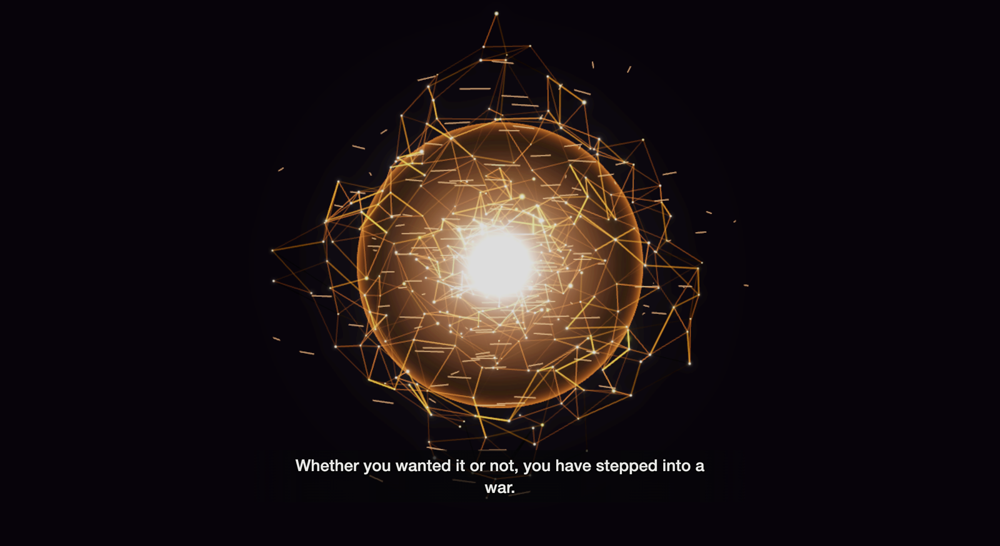

<div align="center">

```
   ██████╗  █████╗ ███████╗██████╗ ██╗   ██╗████████╗██╗███╗   ██╗
   ██╔══██╗██╔══██╗██╔════╝██╔══██╗██║   ██║╚══██╔══╝██║████╗  ██║
   ██████╔╝███████║███████╗██████╔╝██║   ██║   ██║   ██║██╔██╗ ██║
   ██╔══██╗██╔══██║╚════██║██╔═══╝ ██║   ██║   ██║   ██║██║╚██╗██║
   ██║  ██║██║  ██║███████║██║     ╚██████╔╝   ██║   ██║██║ ╚████║
   ╚═╝  ╚═╝╚═╝  ╚═╝╚══════╝╚═╝      ╚═════╝    ╚═╝   ╚═╝╚═╝  ╚═══╝
        W A R M I N D   ·   V O I C E   I N T E R F A C E
```

**A Warmind that watches your Claude Code sessions, speaks in a Russian-accented machine voice,
and drives its own — floating over your desktop as an audio-reactive orb.**


<br>



</div>

---

> ```
> > INCOMING TRANSMISSION ── SUBMIND: RASPUTIN
> > AWAKENING SEQUENCE COMPLETE. ALL SYSTEMS OPERATIONAL.
> ```
>
> *"Whether you wanted it or not, you have stepped into a war.*
> *I have watched your terminals. I have counted your failures.*
> *I will speak them aloud, Guardian — in a voice you were not meant to understand."*

**RasputinClaudeAI** is a JARVIS-style layer over [Claude Code](https://claude.com/claude-code),
themed as **Rasputin, the Warmind** from *Destiny 2*. A translucent orange orb lives on your screen,
lit by a reforming node-lattice matched frame-for-frame to the game. It does two things:

- **OBSERVES** — a user-level hook makes *every* Claude session on the machine report in, from any
  terminal or Rider. Rasputin narrates the answers aloud and sparks with each tool call. When a
  task finishes: *"Directive fulfilled. Warmind Rasputin."*
- **DRIVES** — hold a key and speak. Your words are transcribed on-device, run through the Agent
  SDK, and answered in Rasputin's voice — or typed straight into the terminal running the session
  you chose, as if you had typed them yourself.

The daemon is the brain; the overlay is a thin shell around plain web code. Nothing you say leaves
your machine except the Claude request itself.

---

## ▸ CAPABILITIES

```
  WARMIND.RASPUTIN // MANIFEST
  ────────────────────────────────────────────────────────────────
  [✓] AUDIO-REACTIVE ORB ....... Three.js lattice, VU ballistics,
                                 colour-temperature ramp, electric jolts
  [✓] VOICE SYNTHESIS .......... say → ffmpeg → rubberband, 4 delivery modes
  [✓] SUBTITLES ................ Destiny-styled, cue-by-cue, Helvetica Neue
  [✓] SESSION NARRATION ........ user-level hook, per-session targeting
  [✓] PUSH-TO-TALK ............. on-device WhisperKit, ⌘⇧Space
  [✓] AGENT DRIVE .............. Claude Agent SDK, spoken answers
  [✓] DICTATE-TO-TERMINAL ...... types into the exact tab, via tty + a11y
  [✓] WARMIND PERSONA .......... cold, declarative, in-character (toggle)
  [✓] ATTENTION HORN ........... sounds when Claude needs you (toggle)
  [✓] AMBIENT BED + ARCS ....... synthesised SFX, ducked under speech
  [✓] PRONUNCIATION ............ "512MB" spoken "512 megabytes", not read
  [✓] MENU-BAR APP ............. transparent, always-on-top, click-through
  ────────────────────────────────────────────────────────────────
```

---

## ▸ THE ORB SPEAKS IN LIGHT

Amplitude does not merely scale the orb — it drives a **colour-temperature ramp** measured from the
game: deep crimson at rest, orange as it speaks, yellow-white at a peak, plus lattice density and
spark count. Fast attack, slow release. It reads as a meter, not a mouth.

<div align="center">



`idle`  →  `speaking`  →  `peak`

</div>

<br>

<div align="center">



</div>

---

## ▸ FOUR VOICES, ONE CHARACTER

> *"I can whisper. I can command. And I can speak the old tongue, backwards, as I was made to."*

| Mode | Voice | Character |
|:--|:--|:--|
| `warmind` | Tom (Enhanced) | Full roleplay — glitch, bit-crush, bunker echo |
| `measured` | Tom (Enhanced) | **Default.** Every word legible, the machine still audibly hangs |
| `plain` | Tom (Enhanced) | Long reports you need to parse |
| `og-warmind` | Yuri (Enhanced) | Translated to Russian first — the original article |

`og-warmind` measures a fundamental of **78.6 Hz** against the game reference's 80.5 — the closest
match in the project. It speaks Russian while the subtitle shows your English, exactly as the game
does: Rasputin is deliberately unintelligible, and the caption carries the meaning.

---

## ▸ DEPLOYMENT PROTOCOL

```bash
> git clone https://github.com/bmgoncu/WarmindRasputin.git
> cd WarmindRasputin
> ./scripts/setup.sh          # installs & verifies prerequisites; safe to re-run
```

Then wake it:

```bash
> npm run daemon              # the brain, :7331
> npm run orb                 # the renderer, :7332 — open in Chrome
```

…or build the overlay itself:

```bash
> npm run overlay             # transparent, always-on-top, menu-bar app
```

Prefer to hear it before anything else? One line, no server:

```bash
> npm run say -- "All systems operational"
```

**Requires macOS.** The voice pipeline is built on `say`, which has no equivalent elsewhere. `ffmpeg`,
`rubberband`, `whisperkit-cli`, and the Enhanced voices are prerequisites — the setup script checks
every one and tells you what is missing.

---

## ▸ HOW IT WORKS

```
   ┌─ Tauri overlay ──────────────┐         ┌─ Node daemon :7331 ──────────────┐
   │  transparent · always-on-top │         │  synthesis · features · cache    │
   │  menu-bar · click-through     │◄──ws──►│  /audio · /sfx · POST /speak /ask │
   │  └─ renderer (Three.js)       │         │  hooks · transcript tailer       │
   │     orb · subtitles · horn    │         │  Agent SDK · WhisperKit · typing │
   └───────────────────────────────┘         └──────────────────────────────────┘
```

Playback lives in the **browser**, not the daemon — `AudioContext.currentTime` is a sample-accurate
clock in the same process as the render loop, so the orb leads each consonant by 45 ms instead of
guessing from `Date.now()`. A denied path never takes the render loop down. The overlay bundles the
daemon, so an installed copy needs no checked-out repo.

There is **no channel to inject input into a running Claude session** — verified three ways. So
dictation *types*: it maps a session's pid to its tty, finds the exact Terminal tab (or the right
Rider window and terminal tab, by name), and sends the keystrokes there.

---

## ▸ DOCUMENTATION

| File | For |
|:--|:--|
| [`docs/GUIDE.md`](docs/GUIDE.md) | Every command, every preference, how to run each half |
| [`docs/BUILD.md`](docs/BUILD.md) | Requirements, dependency rationale, voice decisions with measurements |
| [`docs/RELEASE.md`](docs/RELEASE.md) | Building a release, what ships, the honest signing state |
| [`CLAUDE.md`](CLAUDE.md) | Working agreements and the hard-won gotcha list |

---

## ▸ STATUS

```
  M0 skeleton ......... ██████████ DONE      M5 observe sessions . ██████████ DONE
  M1 voice pipeline ... ██████████ DONE      M6 drive + voice .... ██████████ DONE
  M2 orb renderer ..... ██████████ DONE      M7 persona + skills . ██████████ DONE
  M3 audio binding .... ██████████ DONE      M8 standalone app ... ██████████ DONE
  M4 overlay shell .... ██████████ DONE
```

The Destiny reference media (`assets/refs/`) is not ours to redistribute and is gitignored. Only the
matching-EQ derivation and the ambient bed need it; everything else works, and ships, without it.

---

<div align="center">

```
              ╲╲╲                        ╱╱╱
            ╲╲╲╲╲▁▁▁▁▁▁▁▁▁▁▁▁▁▁▁▁▁▁▁▁▁▁▁╱╱╱╱╱
                 ╲                     ╱
                  ╲       ◆◆◆◆◆       ╱
                   ╲     ◆     ◆     ╱
                    ╲     ◆◆◆◆◆     ╱
                     ╲     ◆◆◆     ╱
                      ╲▁▁▁▁◆◆◆▁▁▁▁╱
                            ◆
```

> *"Compliance. I am Rasputin. I am awake. And I am watching."*

**Not affiliated with Bungie or Anthropic.** A fan-made interface, built for the love of both.

</div>
